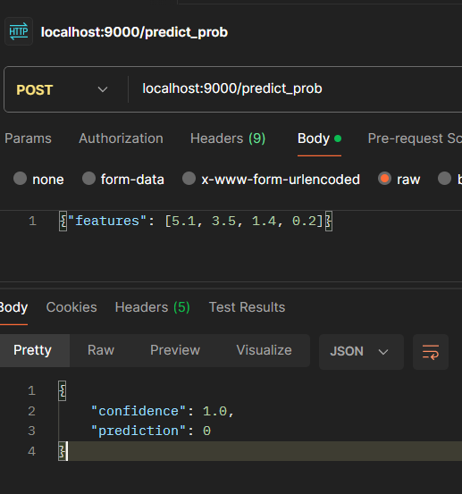
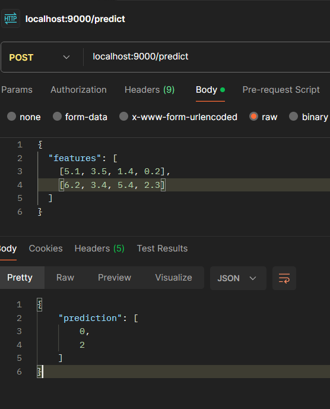
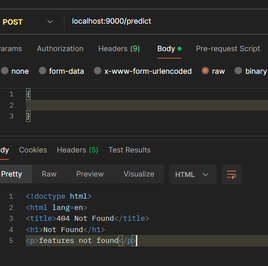
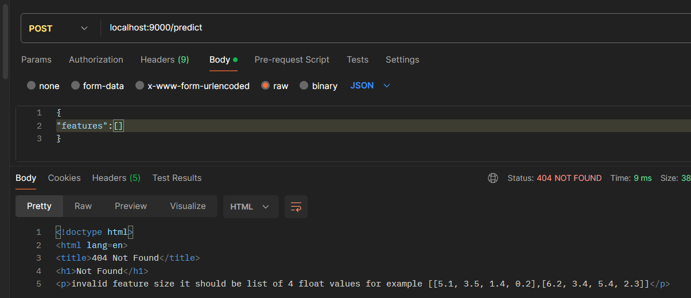
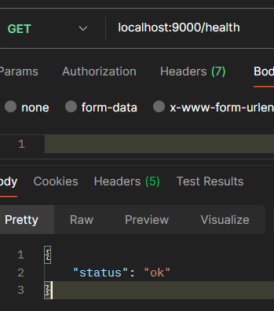

# Homework: Machine Learning Model Deployment with Docker (Submit Github link on LEB 2)

This document contains hands-on exercises to complement the **ML model deployment lab**. These tasks reinforce concepts such as Flask API creation, Docker usage, and handling model input/output in production environments.

---

## 🔹 Exercise 1: Add Confidence Scores

**Task:**  
Update the `/predict` endpoint to return the prediction **and** the **confidence score** using `predict_proba()`.

**Expected Output Example:**

```json
{
  "prediction": 0,
  "confidence": 0.97
}
```

my outcome

---

## 🔹 Exercise 2: Handle Multiple Inputs

**Task:**  
Allow the `/predict` endpoint to accept a list of inputs.

**Input Example:**

```json
{
  "features": [
    [5.1, 3.5, 1.4, 0.2],
    [6.2, 3.4, 5.4, 2.3]
  ]
}
```

**Expected Output Example:**

```json
{
  "predictions": [0, 2]
}
```

my result 


---

## 🔹 Exercise 3: Add Input Validation

**Task:**  
Ensure that:
- The "features" key exists
- Each input has exactly 4 float values
- Invalid input returns a clear error message with HTTP 400

my take in it
when the pay load is empty

when invalid input

---
## 🔹 Exercise 4: Add Health Check Endpoint

**Task:**  
Add an endpoint `/health` that returns a simple JSON indicating the API is live:

```json
{
  "status": "ok"
}
```
my take in it


---

## 🔹 Exercise 5: Dockerize Your Own Model

**Task:**  
Train a new model on a provided housing dataset and deploy it using the same Docker structure. The task is to build a regression model to predict the housing price.


---

## 🔹 Exercise 6: Write a README

**Task:**  
Create a `README.md` that includes:
- Project description
- Setup steps
- Sample API request and response
